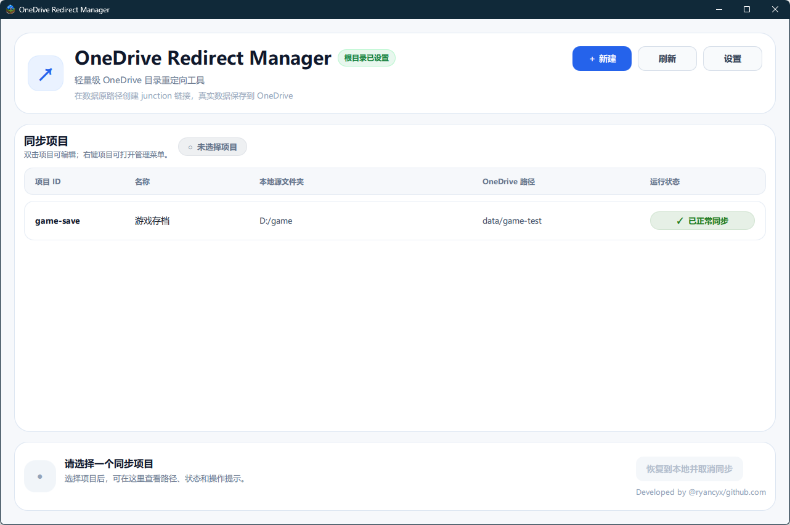
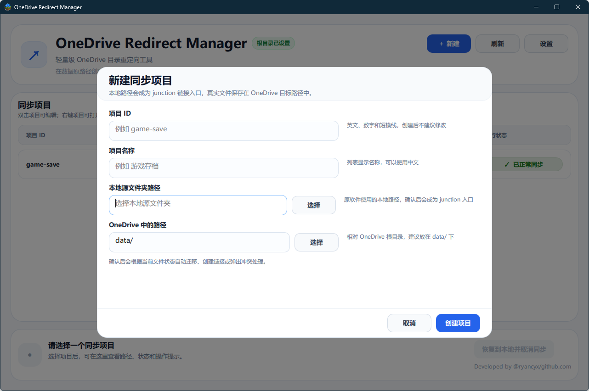
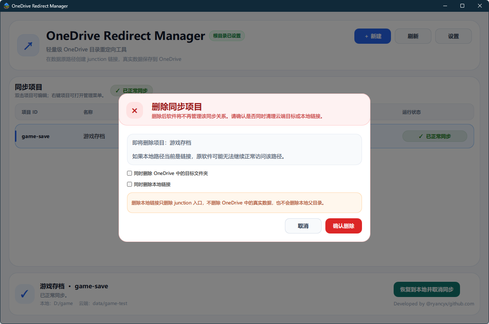
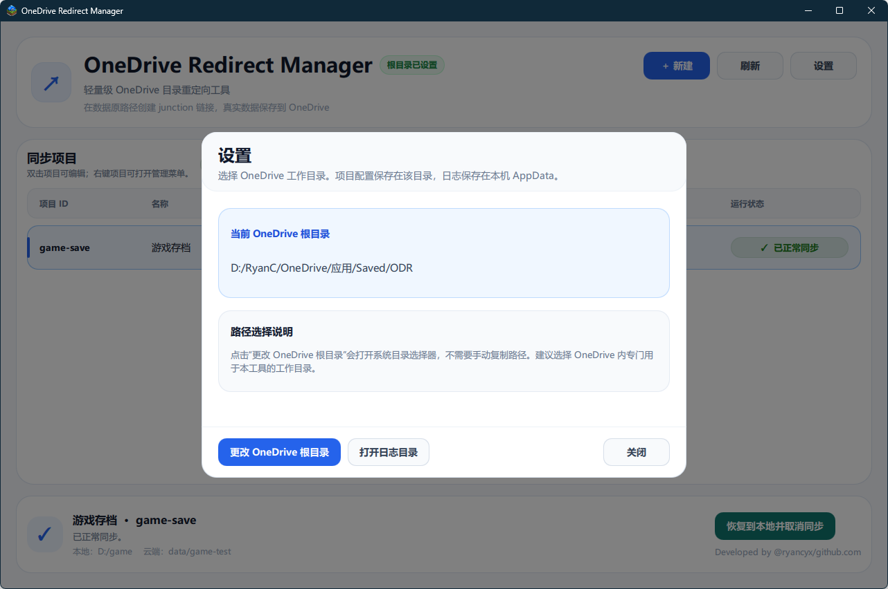

# OneDrive Redirect Manager

> A lightweight Windows desktop tool for managing local-folder-to-OneDrive directory redirection through junction links.

**OneDrive Redirect Manager** 是一个轻量级 Windows 桌面工具，用于管理若干条：

```text
本地源文件夹 → OneDrive 目标文件夹
```

的目录重定向关系。

它会将真实数据保存到 OneDrive 工作目录中，并在原本的数据路径创建 Windows `junction` 链接。这样，原软件仍然访问原路径，但实际读写的是 OneDrive 中的数据。

```text
本地原路径
D:\Games\ExampleSave
        ↓ junction
OneDrive 工作目录
D:\RyanC\OneDrive\...\ODR\data\example-save
```

适合用于管理游戏存档、软件配置、项目数据等需要通过 OneDrive 同步，但原软件又只能读写固定本地路径的场景。

---

## Screenshots

> 将截图放入 `docs/images/` 目录后，GitHub 会自动显示下列图片。

### 主界面



### 新建项目



### 删除项目



### 设置 OneDrive 根目录



---

## Features

- 管理多条本地目录到 OneDrive 目录的重定向关系
- 在本地原路径创建 Windows `junction` 链接
- 真实数据保存在 OneDrive 工作目录中
- 支持新建、编辑、刷新、删除项目
- 支持冲突处理：取消操作，或备份本地目录并使用云端目录
- 支持恢复到本地并取消同步
- 删除项目时可选择仅删除配置、删除 OneDrive 目标文件夹、删除本地 junction 链接，或两者都删
- 支持中文项目名与中文路径
- 支持真实 OneDrive 目录删除 fallback
- 免安装绿色版发布

---

## How It Works

OneDrive Redirect Manager 的核心机制是：

```text
真实数据放入 OneDrive 工作目录
本地原路径创建 junction
原软件继续访问原路径
实际数据由 OneDrive 同步
```

例如，某个软件原本读取：

```text
D:\AppData\Test1
```

工具会将真实数据放到：

```text
D:\RyanC\OneDrive\应用\Saved\ODR\data\test1
```

然后在原路径创建 junction：

```text
D:\AppData\Test1
→ D:\RyanC\OneDrive\应用\Saved\ODR\data\test1
```

从软件视角看，它仍然在读写 `D:\AppData\Test1`；从文件系统视角看，真实数据已经保存在 OneDrive 中。

---

## Usage

### 1. 设置 OneDrive 工作目录

首次启动后，进入 **设置**，选择一个 OneDrive 内的工作目录，例如：

```text
D:\RyanC\OneDrive\应用\Saved\ODR
```

工具会在该目录下维护：

```text
ODR
├─ config.json
├─ data
└─ backups
```

其中：

- `config.json` 保存项目配置
- `data/` 保存真实同步数据
- `backups/` 用于保存冲突处理时的本地备份

### 2. 新建项目

点击 **新建**，填写：

```text
ID：项目唯一标识，例如 game-save
名称：显示名称，例如 游戏存档
本地源文件夹：原软件实际读取的数据路径
OneDrive 路径：OneDrive 工作目录下的相对路径，例如 data/game-save
```

创建后，工具会：

1. 将本地数据迁移或连接到 OneDrive 目标目录
2. 删除原本的普通本地目录入口
3. 创建指向 OneDrive 目标目录的 junction
4. 写入 `config.json`

### 3. 删除项目

右键项目行，选择 **删除**。

删除时可以选择：

| 操作 | 结果 |
|---|---|
| 不勾选任何选项 | 只删除配置记录，不删除本地链接和云端数据 |
| 勾选删除 OneDrive 目标文件夹 | 删除云端真实数据，保留本地链接入口 |
| 勾选删除本地链接 | 删除本地 junction 入口，保留云端数据 |
| 两个都勾选 | 先删除本地 junction，再删除云端目标目录，最后删除配置记录 |

> 推荐在需要彻底删除项目时同时勾选“删除 OneDrive 目标文件夹”和“删除本地链接”，避免留下坏 junction。

### 4. 恢复到本地并取消同步

该操作会：

1. 删除本地 junction
2. 创建真实本地目录
3. 将 OneDrive 目标目录中的数据复制回本地
4. 删除项目配置记录
5. 默认保留 OneDrive 中的数据目录

---

## Download

在 GitHub Release 页面下载：

```text
OneDriveRedirectManager_v0.1.0_windows_x64_green.zip
```

解压后运行：

```text
OneDriveRedirectManager.exe
```

这是免安装绿色版。请不要只复制单个 `.exe`，需要保留同目录下的 `_internal` 文件夹。

---

## Configuration Files

本机设置和日志保存在：

```text
%APPDATA%\OneDriveRedirector
├─ settings.json
└─ logs
   └─ app.log
```

OneDrive 项目配置保存在你选择的 OneDrive 工作目录：

```text
<OneDriveRoot>
├─ config.json
├─ data
└─ backups
```

`config.json` 使用 UTF-8 编码，并使用 `ensure_ascii=False` 写入，因此中文项目名会按原文保存。

示例：

```json
{
  "version": 1,
  "projects": [
    {
      "id": "example-save",
      "name": "示例存档",
      "local_path": "D:/Games/ExampleSave",
      "cloud_relative_path": "data/example-save",
      "created_at": "2026-07-02T12:00:00+08:00",
      "updated_at": "2026-07-02T12:00:00+08:00"
    }
  ]
}
```

---

## Safety Notes

本工具会进行真实文件操作，包括移动目录、创建 junction、删除 junction、删除 OneDrive 目标目录等。使用前请注意：

- 不要将系统目录作为本地源路径
- 不要将 OneDrive 根目录本身作为本地源路径
- 不要将本地源路径设置在 OneDrive 工作目录内部
- 删除 OneDrive 目标文件夹前请确认其中数据不再需要
- 如果 OneDrive 正在同步，删除目录可能会被短暂占用
- 建议先用不重要的测试目录熟悉流程

工具会尽量阻止危险路径，并在删除 junction 时只删除链接入口，不递归删除链接目标。

---

## Development

### Requirements

- Windows 10 / Windows 11
- Python 3.11+
- PySide6
- PyInstaller

### Run from source

```powershell
git clone https://github.com/ryancyx/OneDriveRedirectManager.git
cd OneDriveRedirectManager

python -m venv .venv
.\.venv\Scripts\Activate.ps1

pip install -r requirements.txt
python run.py
```

### Run tests

```powershell
python -m compileall run.py src tests
pytest
```

### Build release package

```powershell
python -m PyInstaller run.py `
  --name OneDriveRedirectManager `
  --windowed `
  --noconfirm `
  --clean `
  --paths src `
  --collect-submodules onedrive_redirector `
  --icon assets\OneDriveRedirectManager.ico `
  --add-data "assets\OneDriveRedirectManager.ico;assets" `
  --add-data "src\onedrive_redirector\ui\qml;onedrive_redirector\ui\qml"
```

打包完成后发布整个目录：

```text
dist\OneDriveRedirectManager
```

不要只发布单个 `.exe`。

---

## Project Status

当前版本：`v0.1.0`

已完成验收：

- 本地有数据，云端为空
- 云端有数据，本地为空
- 冲突取消
- 冲突时备份本地并使用云端
- 恢复到本地并取消同步
- 四种删除组合
- 中文项目名与中文路径
- 真实 OneDrive 目录删除
- PyInstaller one-dir 绿色版打包

---

## Roadmap

后续可能加入：

- 更完整的错误恢复提示
- 项目状态详情页
- 日志查看器
- 自动检测坏 junction
- 一键清理失效项目
- 更完善的 release installer

---

## License

MIT License

---

## Author

Developed by [@ryancyx](https://github.com/ryancyx)

